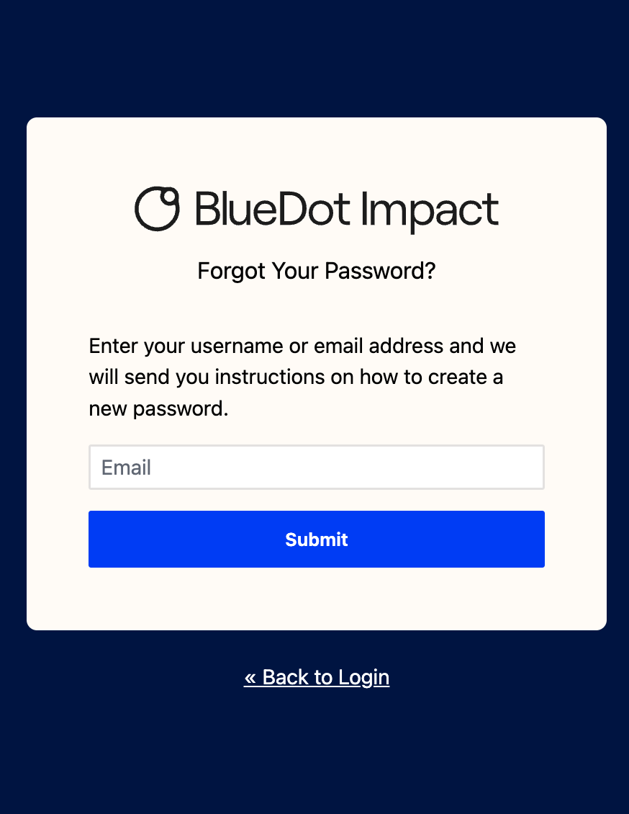

# bluedot-keycloak-theme

This is a component-based [Keycloak](https://www.keycloak.org/) login theme built with [Tailwind CSS](https://github.com/tailwindlabs/tailwindcss) and [Alpine.js](https://github.com/alpinejs/alpine). It's a fork of [Keywind](https://github.com/lukin/keywind).

## **Screenshots**

| | |
|:-------------------------:|:-------------------------:|
| **Login** | **Registration** |
|  |  |
| **IdP Linking Warning** | **IdP Linking via Email** |
|  |  |
| **Password Reset** | |
|  | |

We're taking a 'good enough' approach to theming here. Notably:
- We have not set up custom fonts
- We are not using our React component library (because Keycloak wants weird ftl templates)
  - We decided not to use [Keycloakify](https://www.keycloakify.dev/) as this looked far more complex, and more work to edit from than Keywind

<details>
<summary>List of styled pages</summary>

- Error
- Login
- Login Config TOTP
- Login IDP Link Confirm
- Login IDP Link Email
- Login OAuth Grant
- Login OTP
- Login Page Expired
- Login Password
- Login Recovery Authn Code Config
- Login Recovery Authn Code Input
- Login Reset Password
- Login Update Password
- Login Update Profile
- Login Username
- Login X.509 Info
- Logout Confirm
- Register
- Select Authenticator
- Terms and Conditions
- WebAuthn Authenticate
- WebAuthn Error
- WebAuthn Register
</details>

## Installation

1. Download the jar from the [releases page](https://github.com/bluedotimpact/bluedot-keycloak-theme/releases).
2. Copy it into your `providers` folder.
3. In Keycloak, navigate to 'Realm settings > Themes', and set the 'Login theme' to 'bluedot-keycloak-theme'.

If you want to use the BlueDot Impact logo, set your realm HTML display name to 'BlueDot Impact'.

<details>
<summary>Example production Dockerfile</summary>

```dockerfile
FROM quay.io/keycloak/keycloak:latest AS base

### Build
FROM base AS builder
WORKDIR /opt/keycloak
ENV KC_DB=postgres
ADD --chown=keycloak:keycloak --chmod=644 ./src/bluedot-keycloak-theme.jar /opt/keycloak/providers/
RUN touch -m --date=@1743465600 /opt/keycloak/providers/*
RUN /opt/keycloak/bin/kc.sh build

### Final image
FROM base
COPY --from=builder /opt/keycloak/ /opt/keycloak/
ENV KEYCLOAK_ADMIN=admin
ENTRYPOINT ["/opt/keycloak/bin/kc.sh"]
CMD [ "start", "--optimized" ]
```

</details>

## Contributing

1. Clone the repository
2. Install [Node.js](https://nodejs.org/)
3. Install dependencies with `npm install`
4. Edit files - usually in the `theme` folder, in particular the `components` subfolder
5. Run `npm run build` to create [`dist/bluedot-keycloak-theme.jar`](./dist/bluedot-keycloak-theme.jar) which can be installed as above

## Testing with Docker

You can use the included test Dockerfile to quickly test your theme in a Keycloak instance:

1. Install Node.js and Docker
2. Install Postgres (see [Dockerfile](./Dockerfile)), or comment out the lines about Postgres in [Dockerfile](./Dockerfile)
3. Run `npm run start`
4. Login to Keycloak at http://localhost:8080, with username `admin` and password `admin`
5. Navigate to 'Realm settings > Themes', and set the 'Login theme' to 'bluedot-keycloak-theme'
6. Log out to see the themed login flow

## Releases

Versions follow the [semantic versioning spec](https://semver.org/).

To release:

1. Use `npm version <major | minor | patch>` to bump the version
2. Run `git push --follow-tags` to push with tags
3. Wait for GitHub Actions to publish to GitHub releases.
